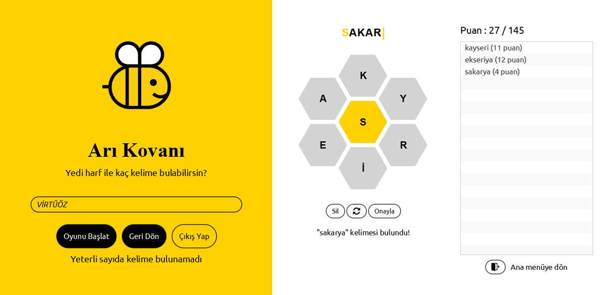

# SpellingBee
The New York Times Spelling Bee clone desktop game written in Java by using JavaFX and MVC design pattern

### Screenshot

# How to execute
You have two options to run the project.

### Using Maven
`mvn clean javafx:run`   
This option might not work if you use a different Java version.

### Using App class
You can use the App class to run the project like a regular Java project.

### Warning
We are using Maven to manage dependencies. Please be sure all dependencies are installed before running the project.
